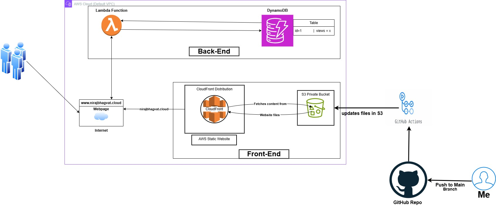

# Cloud Resume Challenge 🚀

This repository contains the source code and configuration for my **Cloud Resume Challenge** project. The challenge involves creating a dynamic, cloud-hosted resume using various AWS services, CI/CD automation, and modern web development practices.

## Project Overview 🌐

The **Cloud Resume Challenge** showcases a resume website hosted on AWS, with dynamic features like a visitor counter stored in DynamoDB. This project also implements a CI/CD pipeline using **GitHub Actions** for automatic deployment to an S3 bucket. The project was published by Forrest Brazeal.

### Key Features

- **Frontend**: A simple, responsive HTML/CSS/JavaScript resume website.
- **Cloud Hosting**: Website hosted on a private **Amazon S3** bucket, distributed via **CloudFront**.
- **Visitor Counter**: A **DynamoDB** table tracks the number of website visits, with a **Lambda function** updating the counter.
- **CI/CD**: Automatic deployments from GitHub to S3 using **GitHub Actions**.

## Architecture Diagram 🏗️
**

## Tech Stack ⚙️

- **Frontend**: HTML, CSS, JavaScript
- **AWS Services**:
  - **S3** for static website hosting
  - **CloudFront** for CDN distribution
  - **DynamoDB** for storing visitor count
  - **Lambda** for backend logic
  - **API Gateway** (or Lambda URL) for exposing the Lambda function
  - **IAM** for managing access and roles
- **CI/CD**: GitHub Actions for automating deployments

## Project Phases 🚀

👉 [Blog Post: Hosting a Portfolio Website on AWS S3 & CloudFront](https://nirajbhagwat.blogspot.com/2024/09/deploying-my-portfolio-website-on-aws.html)

👉 [Blog Post: Adding a Visitor Counter Using Lambda & DynamoDB](https://nirajbhagwat.blogspot.com/2024/10/tracking-website-views-using-aws-lambda.html)

👉 [Blog Post: Automating Deployment with GitHub Actions](https://nirajbhagwat.blogspot.com/2024/10/automating-frontend-deployment-with.html)

## [Live Demo 🔗](https://d2rx5go2oq3any.cloudfront.net/)

